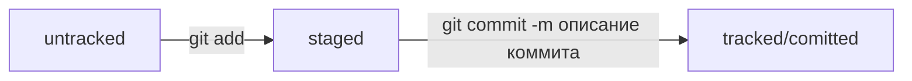

# Практика - шпаргалки по командам 

## Настройка
```
git config --global user.name user
git config --global user.email user@mail.ru
```
## Посмотреть настройки git
```
git config --list
```
## Сделать папку репозиторием
```
git init
```
## Посмотреть в каком состоянии репозиторий
```
git status
```
## Подготовить к сохранению сразу все файлы
```
git add --all
```
## Добавить в репозиторий текущую папку со всеми файлами
```
git add .
```
## Сделать коммит
```
git commit -m "Описание коммита"
```
## Сокращённый лог
```
git log --oneline
```
## Проверить что ssh доступ работает
```
ssh -T git@github.com
```
## Привязать удалённый репозиторий к локальному
```
git remote add origin git@github.com:User/project.git
```
## Убедиться, что репозитории связаны
```
git remote -v
```
## Синхронизировать локальный и удалённый репозиторий
```
git push -u origin main
```
## Отправить изменения на удалённый репозиторий
```
git push
```
## Исправить последний коммит
```
git commit --amend --no-edit
```
## Исправить последний коммит и изменить описание к нему
```
git commit --amend -m "Новое сообщение"
```
## Откатить изменения, которые не попали ни в staging, ни в коммит
```
git restore example.txt
```
## Откатить изменения, которые попали в staging и в коммит
```
git restore --staged example.txt
```
## Вернуть состояние репозитория к более раннему состоянию “b576d89” - хэш коммита до которого всё будет удалено
```
git reset --hard b576d89
```
## Сравнить последнюю закоммиченную версию файла с той, что находится в состоянии modified
```
git diff
```
## Показать изменения в staged-файлах относительно последних закоммиченных версий
```
git diff --staged
```
## Посмотреть, что игнорируется, можно с помощью команды
```
git status --ignored
```
## Статусы

- Статусом untracked помечается файл, о существовании которого Git знает, но не следит за изменениями в нём. Этот статус — противоположность tracked, в который попадают все файлы, отслеживаемые Git.
- Файл переходит в статус staged после выполнения git add.
- Статус modified означает, что файл был изменён.

### Большинство файлов в проектах «шагает» по следующему циклу: «изменён» → «добавлен в список на коммит» → «закоммичен» → «изменён» → и так далее.
